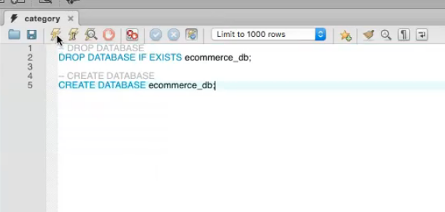
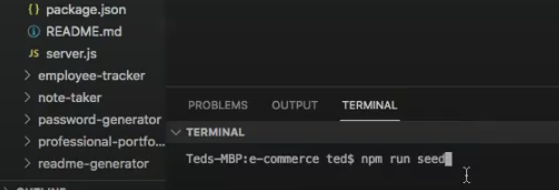
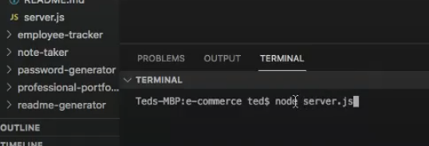
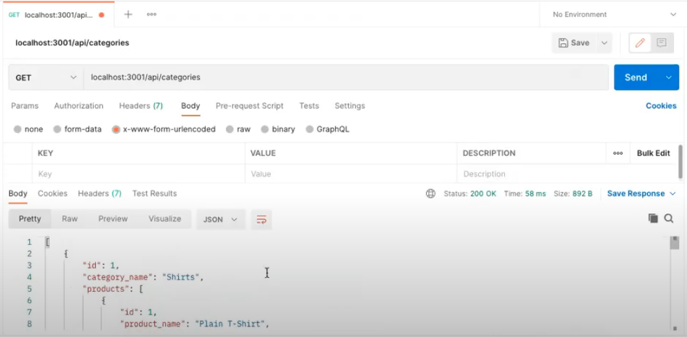
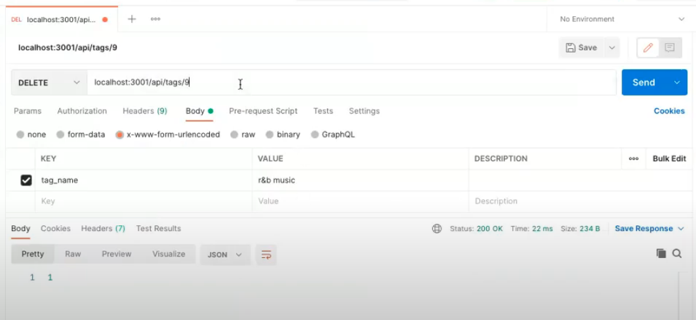
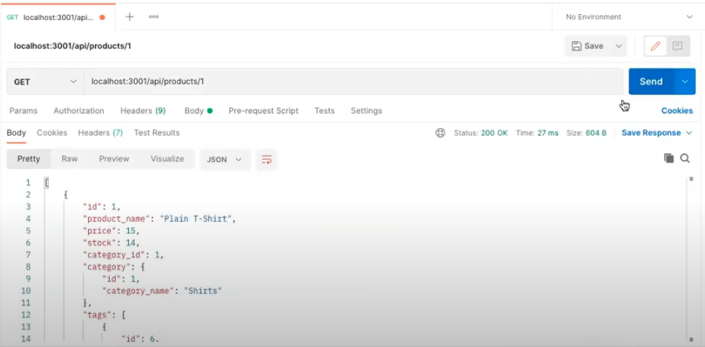
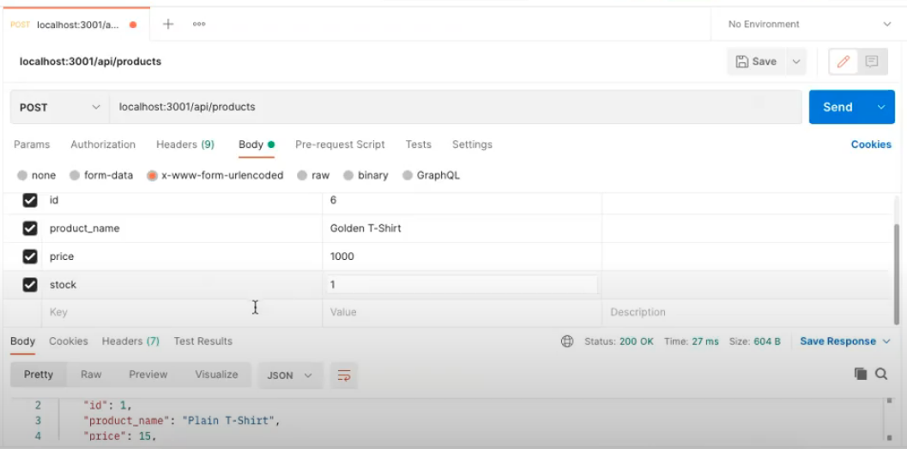
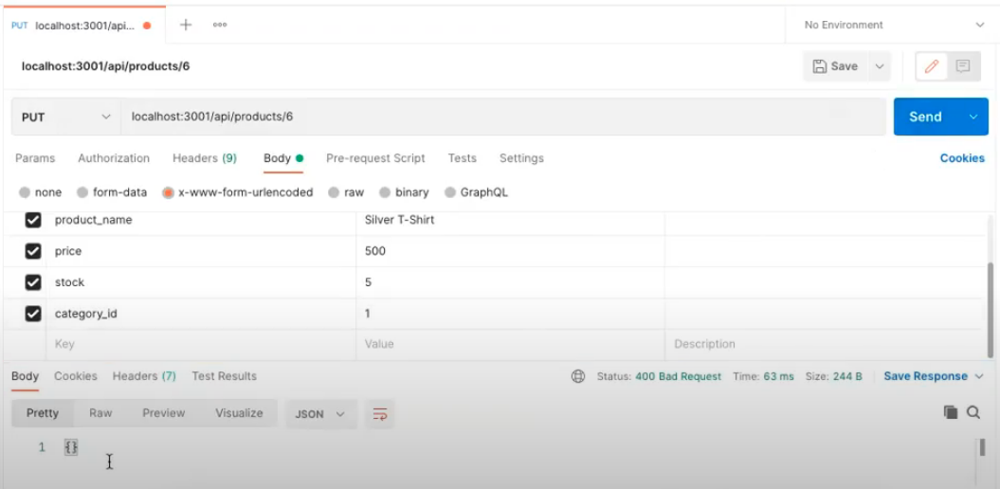
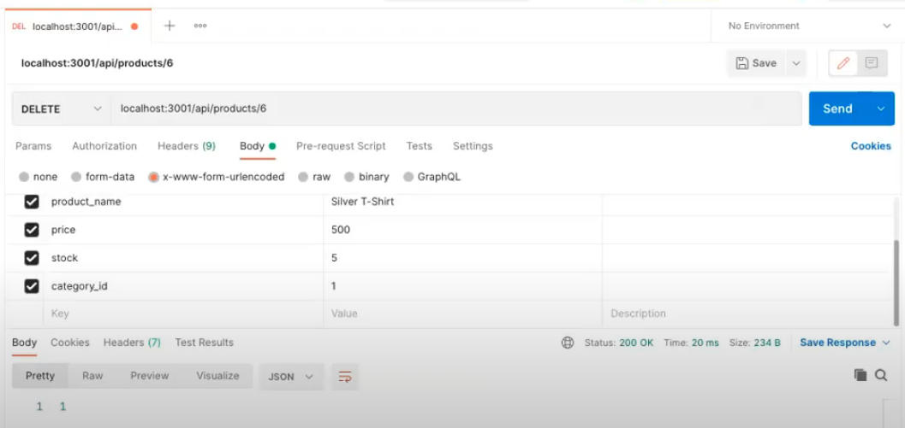

# e-commerce

## Table of Contents

  - [Description](#description)
  - [Installation](#installation)
  - [Usage](#usage)
  - [Contributing](#contributing)
  - [License](#license)
  - [Tests](#tests)
  - [Questions](#questions)
  - [Demo](#demo)
  - [Screenshot](#screenshots)

  ## Description

  What is this app and what does it do:

  This app is designed for a user who wants a functioning back-end e-commerce. Using MySQL as the database repository, VSC as the coding environment, and Postman as the API testing environment, this app, e-commerce, allows a user to establish a diverse amount of categories, products, tags, and product tags. Please note that Insomnia was not used due to its limited 14-day free trial period, but would function equally as well for API route testing. 

  Technologies used: VSC, Javascript, Node, MySQL, mysql2, sequelize, express, dotenv, and Postman.

  * To see the app in action, check out the demo video in the Demo section below.

  ## Installation

  To install npm dependencies (dotenv, mysql2, sequelize, and express), please use this command >> npm install

  ## Usage

  Here's the essentials for what you need to know to use this app: 

  Using the schema.sql file found in the db folder drop this code into a MySQL query. Use the .env.EXAMPLE file and create a .env file and enter in the appropriate info. Go back to VSC and enter npm run seed in the CLI. If successfull, this will seed the data into the proper tables (categories, products, etc). If unsuccessful, use the provided error codes and retrace where the connection is failing (dotenv db name, etc). Now in VSC, run node server.js. This causes the app to listen on port 3001. Open Postman or Insomnia (Postman for this app) and hit the desired routes using the URL bar and key/value table under the body section for the form-urlencoded radio button. After each route is hit, see if the tables in the MySQL database are updating. When satisfied with testing, close Postman and type CTRL + C into VSC. 

  ## Contributing

  To contribute to this app, please follow these instructions: 
  
  Please add descriptive commit messages and comments. Remember to do a npm install for relevant dependencies and other packages that you desire. Create a .gitignore for the node_modules, .env, and package-lock.json folder if/when pushing to GitHub.

  ## License
  
  * No applicable license for this app.

  ## Tests

  * No tests were developed. 
  
  ## Questions

  * If you have any questions/concerns regarding the app, please contact me on GitHub here (see portfolio app): https://github.com/tedheikkila

  ## Demo

* Check out the app's video demo/tutorial here >> https://drive.google.com/file/d/1zULxQ0tJOgtd3ww1Wwx_fmI3tOauD4Tg/view?usp=sharing

## Screenshots

  * load ecommerce_db into a MySQL query (MySQL)

  

   * enter npm run seed (VSC)

  

   * enter node server.js (VSC)

  

  * get all categories (Postman)

  

  * delete a tag (Postman)

  

  * get one product (Postman)

  

  * post a product (Postman)

  

   * update a product (Postman)

  

  * delete a product (Postman)

  
